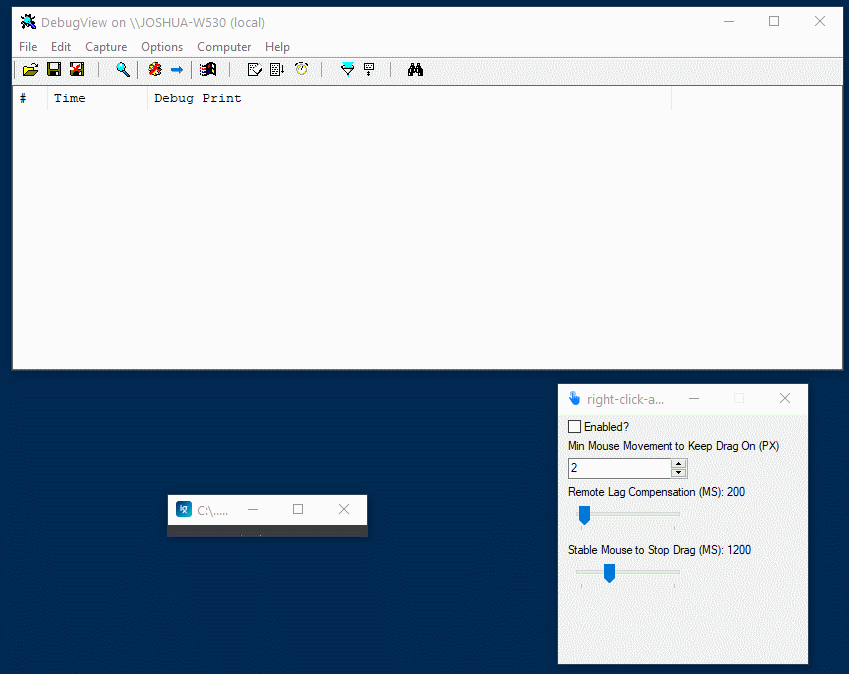

# Right Click and Drag
## Download
Runs as a portable EXE, no installation required. Only Windows support (built with [AutoHotkey](https://www.autohotkey.com/)).

Get the most recent release [here](https://github.com/joshuatz/right-click-and-drag/releases).

## What is this?
This is a tiny utility program, built with an AutoHotkey script, to use the right mouse button to start a click and drag operation. Useful for certain remote control / VNC clients that release mouse buttons on mouse movement (e.g. from touch screen clients).

## How does it work?
When the program is open and "enabled" (checkbox), anytime you right click my program cancels the right click, and instead starts holding down the left mouse button to enabled click and drag. It also starts a timer running and monitors the movement of the mouse. To end the drag operation, you either stop moving your mouse, right click again, or left click.

## Demo

### Specific Use-Case
The specific use-case I built this for is when the Zoom desktop client is used as a host, with a touchscreen user as a meeting participant that is trying to control the host computer via the "Remote Control" feature. Currently, Zoom maps the touchscreen in a way that you can left click, right click, and move the mouse. However, you **cannot** do *both* keep the left mouse button down **and** move the mouse at the same time, which means you can't click and drag.

# About Me:
Feel free to check out my website, [joshuatz.com](https://joshuatz.com/), or find me at [@1joshuatz](https://twitter.com/1joshuatz) on Twitter.